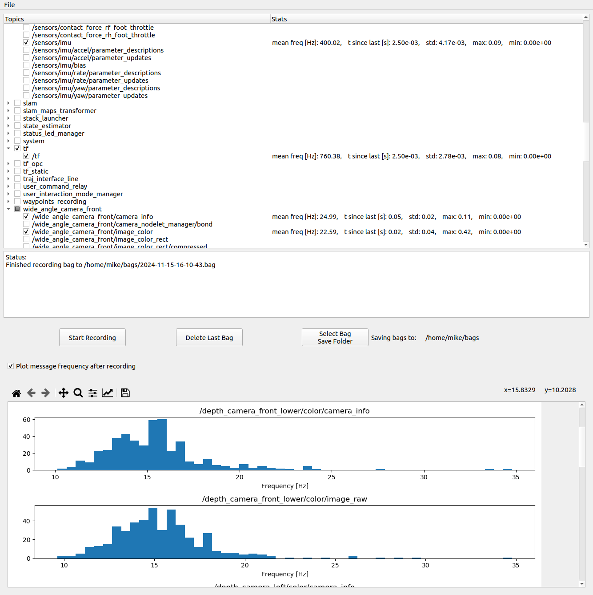

# rosbag_record_gui



GUI for recording rosbags with additional quality-of-life features.

1. Displays the output of `rostopic hz` for selected topics.
2. Allows saving and loading bag record configs as yaml files.
3. Plotting topic frequencies after recording for diagnostics.  

## Installation
Clone and build as a ROS package
```
cd <catkin_ws>/src
git clone https://github.com/clams-casino/rosbag_record_gui.git
catkin build rosbag_record_gui
```

## Usage
```
source <catkin_ws>/devel/setup.bash
rosrun rosbag_record_gui record_gui
```
